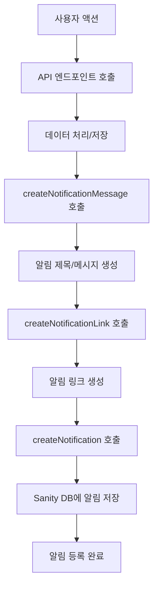

# 알림 시스템 문서

## 1. 알림 시스템 구조

### 알림 모델 (`model/notification.ts`)

```typescript
interface Notification {
  _id: string;
  _type: 'notification';
  type: 'CREATE' | 'UPDATE' | 'DELETE';
  entityType:
    | 'CLUB_MEMBER'
    | 'CLUB'
    | 'POST'
    | 'TOURNAMENT_APPLICATION'
    | 'USER'
    | 'EXPENSE'
    | 'TOURNAMENT'
    | 'QUESTION';
  entityId: string;
  title: string;
  message: string;
  link?: string;
  changes?: Change[];
  readAt?: string;
  userId?: string;
  createdAt: string;
}
```

## 2. 알림 생성 핵심 함수들

### 알림 생성 서비스 (`service/notification.ts`)

- `createNotification()`: Sanity DB에 알림 생성
- `createNotificationMessage()`: 알림 제목과 메시지 생성
- `trackChanges()`: 변경사항 추적 및 기록

### 알림 유틸리티 (`lib/notificationUtils.ts`)

- `createNotificationLink()`: 알림 클릭 시 이동할 링크 생성

## 3. 알림이 등록되는 주요 시나리오

### 📝 **게시글 관련**

- **생성**: `/api/posts/route.ts` - 새 게시글 작성 시
- **수정**: `/api/posts/route.ts` - 게시글 수정 시
- **삭제**: `/api/posts/route.ts` - 게시글 삭제 시

### 🏆 **토너먼트 관련**

- **생성**: `/api/tournaments/route.ts` - 새 토너먼트 등록 시
- **수정**: `/api/tournaments/[id]/route.ts` - 토너먼트 정보 수정 시
- **삭제**: `/api/tournaments/[id]/route.ts` - 토너먼트 삭제 시

### 👥 **회원 관련**

- **가입**: `/api/user/route.ts` - 새 회원 가입 시
- **정보 수정**: `/api/user/route.ts` - 회원 정보 수정 시

### 🎾 **클럽 회원 관련**

- **등록**: `/api/club-member/route.ts` - 클럽 회원 등록 시
- **수정**: `/api/club-member/route.ts` - 클럽 회원 정보 수정 시
- **삭제**: `/api/club-member/route.ts` - 클럽 회원 삭제 시

### 🏅 **토너먼트 참가신청 관련**

- **신청**: `/api/tournament-applications/route.ts` - 참가신청 등록 시
- **상태 변경**: `/api/tournament-applications/[id]/route.ts` - 승인/거절/취소 시

### 💰 **지출내역 관련**

- **등록**: `/api/expenses/route.ts` - 새 지출내역 등록 시
- **수정**: `/api/expenses/[id]/route.ts` - 지출내역 수정 시
- **삭제**: `/api/expenses/[id]/route.ts` - 지출내역 삭제 시

### ❓ **문의 관련**

- **등록**: `service/question.ts` - 새 문의 등록 시
- **답변**: `service/question.ts` - 문의에 답변 등록 시

## 4. 알림 생성 프로세스 흐름



## 5. 알림 메시지 생성 규칙

### 기본 메시지 형식

- **생성**: `"{엔티티명} 등록"` / `"{엔티티명}이(가) 등록되었습니다."`
- **수정**: `"{엔티티명} 수정"` / `"{엔티티명}이(가) 수정되었습니다."`
- **삭제**: `"{엔티티명} 삭제"` / `"{엔티티명}이(가) 삭제되었습니다."`

### 특별 케이스

- **문의 답변**: `"문의 답변 등록"` / `"{문의제목}에 대한 답변이 등록되었습니다."`
- **참가신청 상태 변경**: `"참가신청 상태 변경"` / `"{토너먼트명} {부서}부 참가신청이 {이전상태}에서 {새상태}로 변경되었습니다."`

## 6. 알림 조회 및 관리

### 알림 조회

- `getNotifications()`: 알림 목록 조회
- `getUnreadNotificationCount()`: 읽지 않은 알림 개수 조회

### 알림 상태 관리

- `markNotificationAsRead()`: 개별 알림 읽음 처리
- `markAllNotificationsAsRead()`: 모든 알림 읽음 처리
- `deleteNotification()`: 개별 알림 삭제
- `deleteAllNotifications()`: 모든 알림 삭제 (관리자용)

## 7. 프론트엔드 알림 처리

### 알림 훅 (`hooks/useNotifications.ts`)

- 실시간 알림 조회 (10초마다 자동 갱신)
- 읽음 처리, 삭제 기능
- 읽지 않은 알림 개수 표시

### 알림 페이지 (`app/notifications/page.tsx`)

- 알림 목록 표시
- 알림 클릭 시 해당 페이지로 이동
- 관리자용 전체 알림 삭제 기능

## 8. 알림 시스템의 역할

이 시스템은 사용자의 주요 액션에 대해 자동으로 알림을 생성하여, 시스템의 변화를 실시간으로 추적하고 사용자에게 중요한 정보를 제공하는 역할을 합니다.

### 주요 기능

- **실시간 추적**: 시스템의 모든 주요 변경사항을 자동으로 추적
- **사용자 알림**: 중요한 이벤트에 대한 즉시 알림 제공
- **상태 관리**: 읽음/읽지 않음 상태 관리
- **링크 제공**: 알림 클릭 시 해당 페이지로 바로 이동
- **변경사항 기록**: 수정 시 이전 값과 새로운 값 비교 기록

## 9. 사용자 알림 레벨 시스템

### 사용자 레벨 정의

- **레벨 1**: 클럽가입회원 - 모든 사용자가 알림을 받음
- **레벨 2**: 클럽관리자
- **레벨 3**: 협회 관계자
- **레벨 4**: 경기관리자
- **레벨 5**: 어드민

### 알림 조회 로직

- **개인 알림**: entityId가 사용자 ID와 일치하는 알림은 모든 사용자가 조회 가능
- **레벨별 알림**: 해당 레벨 권한 이상의 사용자만 조회 가능

### 기능별 알림 레벨

#### 📝 **게시글 관련**

- **알림 기능 제공하지 않음** (기존 알림 기능 제거 예정)

#### 🏆 **토너먼트 관련**

- **기존 알림 기능 제거** (생성 시 알림 제거)
- **발행 시 알림**: 임시저장 → 발행 기능 추가 예정 (레벨 1)

#### 👥 **회원 관련**

- **가입**: 레벨 5
- **수정**: 레벨 5

#### 🎾 **클럽 회원 관련**

- **등록**: 레벨 4
- **수정**: 레벨 4
- **삭제**: 레벨 4

#### 🏅 **토너먼트 참가신청 관련**

- **신청**: 레벨 4
- **상태변경**: 참가신청자의 entityId 등록 및 레벨 4

#### 💰 **지출내역 관련**

- **등록**: 레벨 5
- **수정**: 레벨 5
- **삭제**: 레벨 5

#### ❓ **문의 관련**

- **등록**: 레벨 4
- **답변**: 문의 작성자의 entityId 등록 (문의 작성자만 알림 수신)
